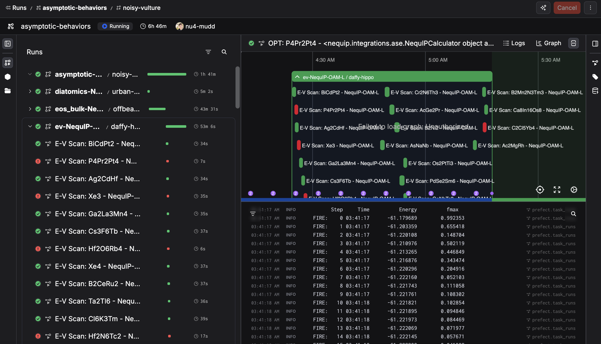

<div align="center">
    <h1>⚔️ MLIP Arena ⚔️</h1>
    <p><b>Fair and transparent benchmark of foundation machine learning interatomic potentials (MLIPs)</b></p>
    <a href="https://huggingface.co/spaces/atomind/mlip-arena"></a>
    <a href="https://atomind-ai-mlip-arena.mintlify.app/introduction"></a>
    <a href="https://neurips.cc/virtual/2025/poster/121648"></a>
    <a href="https://arxiv.org/abs/2509.20630"></a>
    <a href="https://openreview.net/forum?id=ysKfIavYQE#discussion"></a>
    <br>
    <a href="https://github.com/atomind-ai/mlip-arena/actions"></a>
    <a href="https://pypi.org/project/mlip-arena/"></a>
    <a href="https://pypi.org/project/mlip-arena/"></a>
    <a href="https://zenodo.org/doi/10.5281/zenodo.13704399"></a>
    <!-- <a href="https://discord.gg/W8WvdQtT8T"> -->
</div>

---


🚀 **The Future of Atomistic Modeling and Simulation Benchmarks for MLIPs**

Foundation machine learning interatomic potentials (MLIPs), trained on extensive databases containing millions of density functional theory (DFT) calculations, have revolutionized molecular and materials modeling. However, existing benchmarks often suffer from data leakage, limited transferability, and an over-reliance on error-based metrics tied to specific DFT references.

**MLIP Arena** introduces a unified, cutting-edge benchmark platform for evaluating foundation MLIP performance far beyond conventional error metrics. It focuses on revealing the physical soundness learned by MLIPs and assessing their practical utility, remaining completely agnostic to the underlying model architectures and training datasets.

***By moving beyond static DFT references and revealing the critical failure modes*** of current foundation MLIPs in real-world settings, MLIP Arena provides a reproducible framework to guide next-generation MLIP development. We aim to drive improvements in predictive accuracy and runtime efficiency while maintaining robust physical consistency!

⚡ MLIP Arena leverages modern pythonic workflow orchestration with 💙 [Prefect](https://www.prefect.io/) 💙 to enable advanced task/flow chaining, scaling, and caching.



> [!NOTE]
> Contributions of new tasks via PRs are highly welcome! See our [Project Page](https://github.com/orgs/atomind-ai/projects/1) for outstanding tasks, or propose new feature requests in [Discussions](https://github.com/atomind-ai/mlip-arena/discussions/new?category=ideas).

---

## 📖 Official Documentation

For comprehensive guides, API references, and advanced usage, please visit our **[Official Documentation Site](https://atomind-ai-mlip-arena.mintlify.app/introduction)**!

---

## 📢 Announcements

- **[Sep 18, 2025]** 🎊 **[MLIP Arena is accepted as a Spotlight (top 3.5%) at NeurIPS!](https://neurips.cc/virtual/2025/poster/121648)** 🎊
- **[Apr 8, 2025]** 🎉 **[MLIP Arena is accepted as an ICLR AI4Mat Spotlight!](https://openreview.net/forum?id=ysKfIavYQE#discussion)** 🎉 Huge thanks to all co-authors for their contributions!

---

## 🛠️ Installation

### Option 1: From PyPI (Prefect workflow only, *without* pretrained models)

```bash
pip install mlip-arena
```

### Option 2: From Source (with Integrated Pretrained Models)

> [!CAUTION]
> We strongly recommend a **clean build in a new virtual environment** due to compatibility issues between multiple popular MLIPs. We provide a single installation script using `uv` for minimal package conflicts and blazing fast installation!

> [!IMPORTANT]
> To automatically download Fairchem model checkpoints, please ensure you have downloading access to their Hugging Face [***model repo (e.g., OMAT24)***](https://huggingface.co/facebook/OMAT24) (not the dataset repo). You must also log in locally on your machine via `hf auth login` (see [HF Hub authentication](https://huggingface.co/docs/huggingface_hub/en/quick-start#authentication)).

**🐧 Linux**

```bash
# (Optional) Install uv (it's much faster than pip!)
curl -LsSf https://astral.sh/uv/install.sh | sh
source $HOME/.local/bin/env

git clone https://github.com/atomind-ai/mlip-arena.git
cd mlip-arena

# One-script uv pip installation
bash scripts/install.sh
```

> [!TIP]
> Installing all compiled models can consume significant local storage. You can use the pip flag `--no-cache`, and running `uv cache clean` is extremely helpful for freeing up space.

**🍎 Mac OS**

```bash
# (Optional) Install uv
curl -LsSf https://astral.sh/uv/install.sh | sh
source $HOME/.local/bin/env

# One-script uv pip installation
bash scripts/install-macosx.sh
```

---

## ⏩ Quickstart

Instructions for individual benchmarks are provided in the README within each corresponding folder under [`/benchmarks`](../benchmarks/).

For a complete benchmark sweep using HPC resources, see the [`benchmarks/submit.py`](../benchmarks/submit.py) script. Refer to the [Run Benchmarks and Submit Model](#️-run-benchmarks-and-submit-model) section for usage instructions.

---

## ⚙️ Workflow Overview

### ✅ The first Prefect task: Molecular Dynamics

Arena provides a unified interface to run all compiled MLIPs. This can be achieved by simply iterating over `MLIPEnum`:

```python
from mlip_arena.models import MLIPEnum
from mlip_arena.tasks import MD
from mlip_arena.tasks.utils import get_calculator

from ase import units
from ase.build import bulk

atoms = bulk("Cu", "fcc", a=3.6) * (5, 5, 5)

results = []

for model in MLIPEnum:
    result = MD(
        atoms=atoms,
        calculator=get_calculator(
            model,
            calculator_kwargs=dict(), # directly passing to the calculator
            dispersion=True,
            dispersion_kwargs=dict(
                damping='bj', xc='pbe', cutoff=40.0 * units.Bohr
            ), # passing to TorchDFTD3Calculator
        ), # compatible with custom ASE Calculators
        ensemble="nve", # nvt and npt are also available
        dynamics="velocityverlet", # compatible with any ASE Dynamics objects and their class names
        total_time=1e3, # 1 ps = 1e3 fs
        time_step=2, # fs
    )
    results.append(result)
```

### 🚀 Parallelize Benchmarks at Scale

To run multiple benchmarks in parallel, append `.submit` to the task function and wrap your tasks in a flow. This dispatches them to a local or remote worker for concurrent execution. See the Prefect documentation on [tasks](https://docs.prefect.io/v3/develop/write-tasks) and [flows](https://docs.prefect.io/v3/develop/write-flows) for more details.

```python
from prefect import flow

@flow
def run_all_tasks():
    futures = []
    for model in MLIPEnum:
        future = MD.submit(
            atoms=atoms,
            ...
        )
        futures.append(future)

    return [f.result(raise_on_failure=False) for f in futures]
```

For a more practical example using HPC resources, please refer to the [submission script](../benchmarks/submit.py) or our [MD stability benchmark](../benchmarks/stability/temperature.ipynb).

### 🧰 List of Modular Tasks

The implemented tasks are available under `mlip_arena.tasks.<module>.run` or via `from mlip_arena.tasks import *` for convenient imports (note: this currently requires [phonopy](https://phonopy.github.io/phonopy/install.html) to be installed).

- **[OPT](../mlip_arena/tasks/optimize.py#L56)**: Structure optimization
- **[EOS](../mlip_arena/tasks/eos.py#L42)**: Equation of state (energy-volume scan)
- **[MD](../mlip_arena/tasks/md.py#L200)**: Molecular dynamics with flexible dynamics (NVE, NVT, NPT) and temperature/pressure scheduling (annealing, shearing, *etc.*)
- **[PHONON](../mlip_arena/tasks/phonon.py#L110)**: Phonon calculation driven by [phonopy](https://phonopy.github.io/phonopy/install.html)
- **[NEB](../mlip_arena/tasks/neb.py#L96)**: Nudged elastic band
- **[NEB_FROM_ENDPOINTS](../mlip_arena/tasks/neb.py#L164)**: Nudged elastic band with convenient image interpolation (linear or IDPP)
- **[ELASTICITY](../mlip_arena/tasks/elasticity.py#L78)**: Elastic tensor calculation

---

## 🤝 Contribute and Development

PRs are welcome! Please clone the repo and submit PRs with your changes.

To make changes to the Hugging Face Space, fetch large files from git LFS first, and then run Streamlit:

```bash
git lfs fetch --all
git lfs pull
streamlit run serve/app.py
```

### ➕ Add New MLIP Models

If you have pretrained MLIP models that you would like to contribute to MLIP Arena and evaluate in real-time benchmarks, you have two options:

#### External ASE Calculator (Easy / Fast)

1. Implement a new ASE Calculator class in [`mlip_arena/models/externals`](../mlip_arena/models/externals).
2. Name your class with your awesome model name and add the exact same name to the [`registry`](../mlip_arena/models/registry.yaml) with your metadata.

> [!CAUTION]
> Remove unnecessary outputs from the `results` class attributes to avoid errors during MD simulations. Please refer to [CHGNet](../mlip_arena/models/externals/chgnet.py) as an example.

#### Hugging Face Model (Recommended / High Impact)

0. Inherit the Hugging Face [ModelHubMixin](https://huggingface.co/docs/huggingface_hub/en/package_reference/mixins) class in your model class definition. We recommend [PytorchModelHubMixin](https://huggingface.co/docs/huggingface_hub/en/package_reference/mixins#huggingface_hub.PyTorchModelHubMixin).
1. Create a new [Hugging Face Model](https://huggingface.co/new) repository and upload the model file using the [push_to_hub function](https://huggingface.co/docs/huggingface_hub/en/package_reference/mixins#huggingface_hub.ModelHubMixin.push_to_hub).
2. Follow the template to code the I/O interface for your model [here](../mlip_arena/models/README.md).
3. Update the model [`registry`](../mlip_arena/models/registry.yaml) with the necessary metadata.

### 🏃‍♂️ Run Benchmarks and Submit Model

Once your model is ready (either registered or initialized as a custom ASE Calculator), you can run the core benchmark suite on a SLURM cluster:

1. Move into the `benchmarks/` directory:
   ```bash
   cd benchmarks
   ```
2. Open and modify the `submit.py` template script. Under the **USER CONFIGURATION** section:
   - Provide your `MODEL` (as a registered string or custom ASE Calculator instance).
   - Adjust the `SLURM_CONFIG` parameters for your specific HPC allocation (including any conda environments or module loads in the `job_script_prologue`).
3. Submit the pipeline:
   ```bash
   python submit.py
   ```
   This will dynamically distribute and run the core benchmarks (diatomics, EOS bulk, and E-V scans) via a Dask-Jobqueue on your SLURM cluster.

### ➕ Add New Benchmark

> [!NOTE]
> Please reuse, extend, or chain the general tasks defined [above](#list-of-modular-tasks) and add your new folder and scripts under [`/benchmarks`](../benchmarks/).

---

## 📜 Citation

If you find this work and platform useful, please consider citing the following:

```bibtex
@inproceedings{
    chiang2025mlip,
    title={{MLIP} Arena: Advancing Fairness and Transparency in Machine Learning Interatomic Potentials via an Open, Accessible Benchmark Platform},
    author={Yuan Chiang and Tobias Kreiman and Christine Zhang and Matthew C. Kuner and Elizabeth Jin Weaver and Ishan Amin and Hyunsoo Park and Yunsung Lim and Jihan Kim and Daryl Chrzan and Aron Walsh and Samuel M Blau and Mark Asta and Aditi S. Krishnapriyan},
    booktitle={The Thirty-ninth Annual Conference on Neural Information Processing Systems Datasets and Benchmarks Track},
    year={2025},
    url={https://openreview.net/forum?id=SAT0KPA5UO}
}
```
