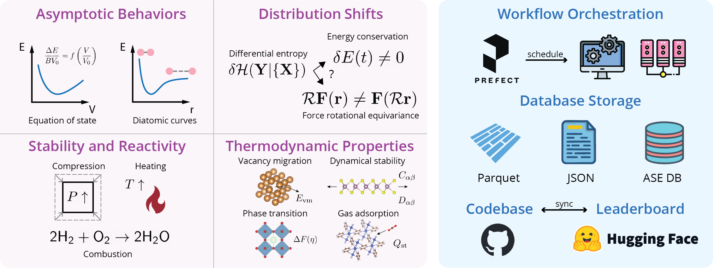

<div align="center">
    <h1>⚔️ MLIP Arena ⚔️</h1>
    <a href="https://openreview.net/forum?id=ysKfIavYQE#discussion"></a>
    <a href="https://huggingface.co/spaces/atomind/mlip-arena"></a>
    <a href="https://github.com/atomind-ai/mlip-arena/actions"></a>
    <a href="https://pypi.org/project/mlip-arena/"></a>
    <a href="https://pypi.org/project/mlip-arena/"></a>
    <a href="https://zenodo.org/doi/10.5281/zenodo.13704399"></a>
    <!-- <a href="https://discord.gg/W8WvdQtT8T"> -->
</a>
</div>

Foundation machine learning interatomic potentials (MLIPs), trained on extensive databases containing millions of density functional theory (DFT) calculations, have revolutionized molecular and materials modeling, but existing benchmarks suffer from data leakage, limited transferability, and an over-reliance on error-based metrics tied to specific density functional theory (DFT) references.

We introduce MLIP Arena, a unified benchmark platform for evaluating foundation MLIP performance beyond conventional error metrics. It focuses on revealing the physical soundness learned by MLIPs and assessing their utilitarian performance agnostic to underlying model architecture and training dataset. 

***By moving beyond static DFT references and revealing the important failure modes*** of current foundation MLIPs in real-world settings, MLIP Arena provides a reproducible framework to guide the next-generation MLIP development toward improved predictive accuracy and runtime efficiency while maintaining physical consistency.

MLIP Arena leverages modern pythonic workflow orchestrator 💙
 [Prefect](https://www.prefect.io/) 💙
 to enable advanced task/flow chaining and caching.



> [!NOTE]
> Contributions of new tasks through PRs are very welcome! If you're interested in joining the effort, please reach out to Yuan at [cyrusyc@berkeley.edu](mailto:cyrusyc@berkeley.edu). See [project page](https://github.com/orgs/atomind-ai/projects/1) for some outstanding tasks, or propose new feature requests in [Discussion](https://github.com/atomind-ai/mlip-arena/discussions/new?category=ideas).

## Announcement

- **[April 8, 2025]** [🎉 **MLIP Arena is accepted as an ICLR AI4Mat Spotlight!** 🎉](https://openreview.net/forum?id=ysKfIavYQE#discussion) Huge thanks to all co-authors for their contributions!


## Installation

### From PyPI (prefect workflow only, without pretrained models)

```bash
pip install mlip-arena
```

### From source (with integrated pretrained models, advanced)

> [!CAUTION] 
> We strongly recommend clean build in a new virtual environment due to the compatibility issues between multiple popular MLIPs. We provide a single installation script using `uv` for minimal package conflicts and fast installation!

> [!CAUTION]
> To automatically download farichem OMat24 checkpoint, please make sure you have gained downloading access to their HuggingFace [***model repo***](https://huggingface.co/facebook/OMAT24) (not dataset repo), and login locally on your machine through `huggginface-cli login` (see [HF hub authentication](https://huggingface.co/docs/huggingface_hub/en/quick-start#authentication))

**Linux**

```bash
# (Optional) Install uv, way faster than pip, why not? :)
curl -LsSf https://astral.sh/uv/install.sh | sh
source $HOME/.local/bin/env

git clone https://github.com/atomind-ai/mlip-arena.git
cd mlip-arena

# One script uv pip installation
bash scripts/install.sh
```

> [!TIP]
> Sometimes installing all compiled models takes all the available local storage. Optional pip flag `--no-cache` could be uesed. `uv cache clean` will be helpful too.

**Mac**

```bash
# (Optional) Install uv
curl -LsSf https://astral.sh/uv/install.sh | sh
source $HOME/.local/bin/env
# One script uv pip installation
bash scripts/install-macosx.sh
```

## Quickstart

### The first example: Molecular Dynamics

Arena provides a unified interface to run all the compiled MLIPs. This can be achieved simply by looping through `MLIPEnum`:

```python
from mlip_arena.models import MLIPEnum
from mlip_arena.tasks import MD 
from mlip_arena.tasks.utils import get_calculator

from ase import units
from ase.build import bulk

atoms = bulk("Cu", "fcc", a=3.6) * (5, 5, 5)

results = []

for model in MLIPEnum:
    result = MD(
        atoms=atoms,
        calculator=get_calculator(
            model,
            calculator_kwargs=dict(), # passing into calculator
            dispersion=True,
            dispersion_kwargs=dict(
                damping='bj', xc='pbe', cutoff=40.0 * units.Bohr
            ), # passing into TorchDFTD3Calculator
        ), # compatible with custom ASE Calculator
        ensemble="nve", # nvt, nvt available
        dynamics="velocityverlet", # compatible with any ASE Dynamics objects and their class names
        total_time=1e3, # 1 ps = 1e3 fs
        time_step=2, # fs
    )
    results.append(result)
```

### 🚀 Parallelize Benchmarks at Scale

To run multiple benchmarks in parallel, add `.submit` before the task function and wrap all the tasks into a flow to dispatch the tasks to worker for concurrent execution. See Prefect Doc on [tasks](https://docs.prefect.io/v3/develop/write-tasks) and [flow](https://docs.prefect.io/v3/develop/write-flows) for more details.

```python
...
from prefect import flow

@flow
def run_all_tasks:

    futures = []
    for model in MLIPEnum:
        future = MD.submit(
            atoms=atoms,
            ...
        )
        future.append(future)

    return [f.result(raise_on_failure=False) for f in futures]
```

For a more practical example using HPC resources, please now refer to [MD stability benchmark](../benchmarks/stability/temperature.ipynb).

### List of implemented tasks

The implemented tasks are available under `mlip_arena.tasks.<module>.run` or `from mlip_arena.tasks import *` for convenient imports (currently doesn't work if [phonopy](https://phonopy.github.io/phonopy/install.html) is not installed).

- [OPT](../mlip_arena/tasks/optimize.py#L56): Structure optimization
- [EOS](../mlip_arena/tasks/eos.py#L42): Equation of state (energy-volume scan)
- [MD](../mlip_arena/tasks/md.py#L200): Molecular dynamics with flexible dynamics (NVE, NVT, NPT) and temperature/pressure scheduling (annealing, shearing, *etc*)
- [PHONON](../mlip_arena/tasks/phonon.py#L110): Phonon calculation driven by [phonopy](https://phonopy.github.io/phonopy/install.html)
- [NEB](../mlip_arena/tasks/neb.py#L96): Nudged elastic band
- [NEB_FROM_ENDPOINTS](../mlip_arena/tasks/neb.py#L164): Nudge elastic band with convenient image interpolation (linear or IDPP)
- [ELASTICITY](../mlip_arena/tasks/elasticity.py#L78): Elastic tensor calculation

### Contribute and Development

PRs are welcome. Please clone the repo and submit PRs with changes.

To make change to huggingface space, fetch large files from git lfs first and run streamlit:

```
git lfs fetch --all
git lfs pull
streamlit run serve/app.py
```

### Add new benchmark tasks (WIP)

> [!NOTE]
> Please reuse, extend, or chain the general tasks defined [above](#list-of-implemented-tasks)

### Add new MLIP models 

If you have pretrained MLIP models that you would like to contribute to the MLIP Arena and show benchmark in real-time, there are two ways:

#### External ASE Calculator (easy)

1. Implement new ASE Calculator class in [mlip_arena/models/externals](../mlip_arena/models/externals). 
2. Name your class with awesome model name and add the same name to [registry](../mlip_arena/models/registry.yaml) with metadata.

> [!CAUTION] 
> Remove unneccessary outputs under `results` class attributes to avoid error for MD simulations. Please refer to [CHGNet](../mlip_arena/models/externals/chgnet.py) as an example.

#### Hugging Face Model (recommended, difficult)

0. Inherit Hugging Face [ModelHubMixin](https://huggingface.co/docs/huggingface_hub/en/package_reference/mixins) class to your awesome model class definition. We recommend [PytorchModelHubMixin](https://huggingface.co/docs/huggingface_hub/en/package_reference/mixins#huggingface_hub.PyTorchModelHubMixin).
1. Create a new [Hugging Face Model](https://huggingface.co/new) repository and upload the model file using [push_to_hub function](https://huggingface.co/docs/huggingface_hub/en/package_reference/mixins#huggingface_hub.ModelHubMixin.push_to_hub).
2. Follow the template to code the I/O interface for your model [here](../mlip_arena/models/README.md). 
3. Update model [registry](../mlip_arena/models/registry.yaml) with metadata

## Citation

If you find the work useful, please consider citing the following:

```bibtex
@inproceedings{
    chiang2025mlip,
    title={{MLIP} Arena: Advancing Fairness and Transparency in Machine Learning Interatomic Potentials through an Open and Accessible Benchmark Platform},
    author={Yuan Chiang and Tobias Kreiman and Elizabeth Weaver and Ishan Amin and Matthew Kuner and Christine Zhang and Aaron Kaplan and Daryl Chrzan and Samuel M Blau and Aditi S. Krishnapriyan and Mark Asta},
    booktitle={AI for Accelerated Materials Design - ICLR 2025},
    year={2025},
    url={https://openreview.net/forum?id=ysKfIavYQE}
}
```